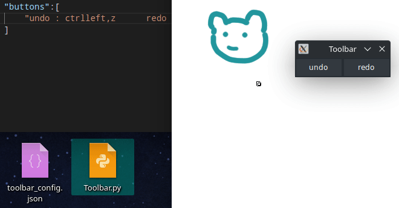

# onscreen shortcut buttons
A customisable onscreen shortcut toolbar for creative applications



## Why?
I switched to linux but I miss my windows onscreen toolbar, then I remembered, oh duh, I'm learning to program. I can MAKE one. cue python.

## Requirements:
- python 3 (google "install python on Windows/Linux/Mac")
- maybe tk (google "install tkinter on Windows/Linux/Mac")

## How to use:

run `python3 Toolbar.py` in terminal, powershell, cmd, whatever you have

If you are on mac OS you WILL need to change the code (change `alt_tab = "'alt','tab'"` to `"'command','shift','tab'"`)

It can run with or without the config file, but you need the config to customise it.
Separate each row onto a line in the text file and follow the following conventions:

### Configuration of buttons/hotkeys:
#### 1 keyboard key:
`BUTTON_TEXT "keyboard_key"`
#### 2 keyboard keys:
`BUTTON_TEXT "keyboard_key1","keyboard_key2"`
#### 3+ keyboard keys:
`BUTTON_TEXT "keyboard_key1","keyboard_key2","keyboard_key3",... and to infinity`

See https://pyautogui.readthedocs.io/en/latest/keyboard.html#keyboard-keys for all possible keys

#### Configuration example of 3 columns:
```BUTTON_TEXT "keyboard_button"<4spaces>BUTTON_TEXT "keyboard_button"<4spaces>BUTTON_TEXT "keyboard_button"```
(replace <4spaces> with 4 spaces)

Do NOT add or remove the spaces in the config. Do NOT use tab instead of 4 spaces between the buttons.
The code relies on finding the spaces to seppartate the buttons (to be changed) and will error if changed

### known issues:
 - terrible, if not impossible to move the window with only one column
 - I have no idea what will happen if you have 3 columns in one row, then 2 in the next.
   so if you use 3 columns+, have a row with 3+ or a row with 1, nothing inbetween
 - terrible code :P
 - terrible config?
 - I am a github noob (first public project)
 - Sometimes the buttons don't work or do something weird (because of alt-tab behaviour)

##### Small caveat:
it relies on alt-tab to switch to the window that you want to use the shortcut on. I can't predict the behaviour it will have if you have alt-tab assigned to something else. I plan to hunt alternative methods.
